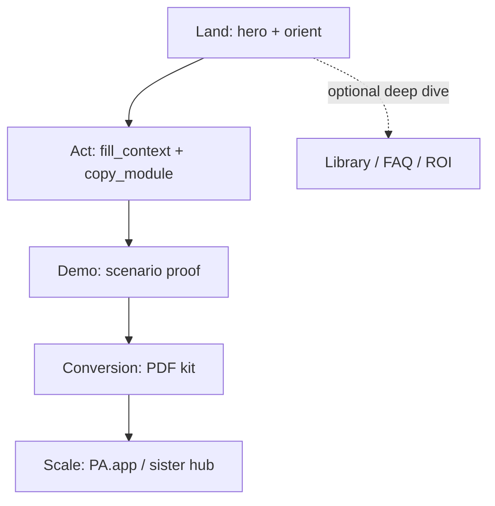
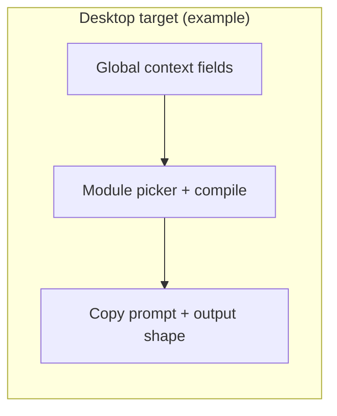

# Strategic revision plan — PromptAnatomy Executive OS (CEO/COO landing)

**Audience:** product owner, design, and engineering.  
**Scope:** content, information architecture, CTAs, visuals, diagrams/schemes, bilingual parity, and static MVP constraints from `AGENTS.md` / `project-direction.mdc`.  
**Non-goals:** backend, login, analytics scripts, or turning the page into a course app.

---

## Executive summary (read this first)

**Goal:** One static page that orients a CEO in seconds, runs a **Global Context + Modules** action (copy one compiled prompt), proves value in the demo, converts with the printable kit (`#kit`), then optionally hands off to PromptAnatomy — with EN/LT parity and no backend.

**Canonical “what shipped” references:** [`CODEBASE_OVERVIEW.md`](CODEBASE_OVERVIEW.md), [`SOURCE_OF_TRUTH.md`](SOURCE_OF_TRUTH.md), [`CHANGELOG.md`](../CHANGELOG.md), [`src/layouts/Page.astro`](../src/layouts/Page.astro).

**Shipped baseline (do not contradict in backlog text):** Hero + **HeroBento** → memes **3 → 0 → 2** (with **BeforeAfter**/Promo between beats) → **ExecutiveModules `#context`** → **ClarityDemo `#demo`** → meme **5** → **SafetyCheck `#safety-check`** → **CourseCTA `#kit`** → **AuthorityBridge** → **PromptAnatomy** → **RoiPath** → meme **4** → **Faq `#faq`** → **PromptLibrary `#library`**. The old `FlowScheme` / `HeroTrust` / **`QuickPractice`** slide code lived in git history only after **2026-04-28** cleanup; live spine is **`ExecutiveModules`**, not QuickPractice.

**Themes that drive the backlog in §1–12:** (1) one visually primary CTA per major section where possible; (2) deduplicate safety, PDF, and “free/static” messaging where still noisy; (3) keep depth (anatomy, 35-prompt library) optional and last.

**Next steps to pull from this doc:** prioritize any open items in §4 (CTA ladder), §5 (content), and §6 (visuals) — treat rows below as the detailed spec, not a daily checklist.

---

## 1. Purpose and alignment

### 1.1 Mission (from `AGENTS.md`)

| Commitment | Implication for revision |
|------------|----------------------------|
| One page, fast aha | **Cap** scroll depth and **one** dominant story arc per viewport “chapter.” |
| Under ~10 seconds to understand | Above-the-fold must answer: *what is this, what do I do, what do I get* without scrolling. |
| Static MVP | All improvements must remain copy, layout, assets, and light client JS. |
| Bilingual EN/LT | Every UI string (including disclosure labels) lives in `src/content/locales/en.ts` and `lt.ts` (re-exported via `copy.ts`). |
| Conversion path | Context+Modules → proof → kit download → optional PromptAnatomy — **order and emphasis** matter more than new features. |

### 1.2 North-star outcome

**After revision, a CEO should be able to:**

1. Understand the offer in **one screen** (hero).
2. **Do** the context+modules action without cognitive overload.
3. **See** static proof (demo) without hunting for it.
4. **Download** the kit with a clear reason *why* now.
5. **Optionally** open PromptAnatomy when they want team scale — not before step 2–4 feel complete.

---

## 2. Situation summary (baseline)

- **Strengths:** Strong copy model (decision, risk, trade-off, owner), consistent gold/navy system, clipboard UX with fallback, real `/en/` `/lt/` routes, PDF + schema + FAQ depth, nav anchors **`#context` / `#demo` / `#kit`**, spine order **demo before** anatomy + ROI **before** FAQ (library last).
- **Open friction (revisit periodically):** Long vertical stack; hero **primary** still often off-site first; **multiple PDF touchpoints** (demo, CTA, library); safety messaging may still feel adjacent to ROI step copy—tune qualitatively, not by re-breaking the shipped stack without intent.

Older issues **resolved** in code (keep for history in `CHANGELOG`): placeholder trust hidden, meme order **documented** (`VISUAL_CONTENT_MAP` + `Page.astro` comments), `#demo` in nav, SystemVisual **merged into FAQ** answer.

This plan turns remaining frictions into **sequenced work**, not a single big-bang rewrite.

---

## 3. Target user journey (strategic)

### 3.1 Funnel roles

Assign **exactly one primary job** per zone so CTAs stop competing.

| Zone | Primary job | Allowed secondary |
|------|-------------|-------------------|
| **A — Orient** | Understand + trust | Language, skip link |
| **B — Act** | Complete practice + copy | Link to demo anchor |
| **C — Believe** | See proof (demo) + optional anatomy | Copy prompts only |
| **D — Commit** | Download PDF | Single “full product” link |
| **E — Scale** | PromptAnatomy + sister hub | Legal/footer |

### 3.2 Ideal journey (post-revision)

### 3.3 Current vs target section order (conceptual)

**Current (shipped — see `Page.astro`):** Hero + HeroBento → meme(3) → BeforeAfter → meme(0) → `#context` (ExecutiveModules) → PromoBanner → meme(2) → `#demo` → meme(5) → SafetyCheck → `#kit` → AuthorityBridge → PromptAnatomy → RoiPath → meme(4) → FAQ → PromptLibrary.

**Target (conceptual — phases may implement partially; many items already match “target”):**

1. **Orient:** Hero (+ optional **real** trust signal or remove placeholder strip).
2. **Act:** Context Block + Modules (compiled prompts) with one safety surface (rules / send-check).
3. **Believe:** Demo **earlier** than long theory blocks *or* theory collapsed behind “How it works” disclosure.
4. **Habit (optional):** ROI path **after** demo + download motivation *or* shortened to inline strip.
5. **Commit:** Single **conversion band** (PDF primary, PA secondary).
6. **Scale:** Authority bridge + footer.
7. **Depth:** System visual + library **last**, both clearly “reference.”

---

## 4. CTA strategy (detailed)

### 4.1 Problems today

- Hero **primary** pushes **off-site** before practice (conversion-first vs. comprehension-first tension).
- **PDF** appears in mobile menu, demo follow-up, library, course CTA — good for reach, **bad for story** (“when should I click?”).
- **Two destinations** on AuthorityBridge split attention (mother vs sister).

### 4.2 CTA rules (revision policy)

1. **One visual primary button** per major viewport section (hero strip, **`#context`** section end, **`#demo`** end, **`#kit`** band).
2. **Hero:** **Shipped** = gold **in-page** primary (`#context`) + outlined PromptAnatomy outbound (UTM `hero`/`primary`) + **nav** links to **`#context` / `#demo` / `#kit`**. When iterating, choose consciously: comprehension-first (emphasize in-page anchors) vs product-led (emphasize PA)—see §4.1 tension.
3. **PromptAnatomy:** Reserve **primary** treatment for **after** demo or after first successful copy action (micro-commitment).
4. **PDF:** Keep **one** “canonical” download moment in the main story (e.g. post-demo + repeated in footer or library only).
5. **UTMs:** Keep existing parameters; document a **matrix** in `VISUAL_CONTENT_MAP.md` or a small `docs/UTM_MATRIX.md` so new links stay consistent.

### 4.3 Recommended CTA ladder (default recommendation)

| Step | Primary CTA label intent | Destination |
|------|--------------------------|-------------|
| 1 | “Use context + modules” / 2‑minute framing (if copy says so) | `#context` |
| 2 | “Open demo” / clarity check | `#demo` |
| 3 | “Download CEO/COO kit (PDF)” | `#kit` / static PDF |
| 4 | “Open PromptAnatomy” | `promptanatomy.app` with UTM |

Hero gradient button currently emphasizes **`#context`** (comprehension-first); PromptAnatomy outbound remains available as an outlined hero CTA with UTM. Reconcile hero vs nav per §4.1 intentionally when you iterate.

### 4.4 Authority bridge

- **Option A (clarity):** Mother card = **primary** (full platform); sister = text link or smaller card.
- **Option B (ecosystem):** Equal weight but **explicit copy**: “Choose one next step” + one sentence each — reduces ambiguity.

---

## 5. Content revision plan

### 5.1 Hero and orient

| Action | Detail |
|--------|--------|
| **Tighten** headline/subhead to **one** outcome + **one** mechanism (already improved in changelog; revisit after CTA change). |
| **Trust:** Replace placeholder row with **real logos**, **client quotes**, or **remove strip** until assets exist — **never** “placeholder” in customer-facing copy. |
| **Nav:** Shipped: `#context`, `#demo`, `#kit`. Optional: `#faq` / `#library` if you add without cluttering mobile. |

### 5.2 Executive modules + safety (de-duplication)

| Action | Detail |
|--------|--------|
| **Merge narrative:** Treat SafetyCheck as **expansion** of practice step 4, not a second chapter — e.g. one section with **tabs** or **anchor jump** “Full safety prompt” inside the same `<section>` landmark. |
| **Copy:** One “risk shield” message; SafetyCheck bullets become **appendix** or collapsible. |

### 5.3 Prompt anatomy + ROI

| Action | Detail |
|--------|--------|
| **Anatomy:** Consider `
` “Five blocks (expand)” default **closed** for scan-first CEOs. |
| **ROI:** Shorten body copy; keep **one** diagram; consider **mobile-first** linear story as the **canonical** copy and desktop ring as enhancement. |

### 5.4 FAQ

| Action | Detail |
|--------|--------|
| **FAQ position:** Shipped **after** ROI + last meme, **before** Prompt Library (depth last). Further tweak only if conversion testing says so. |
| FAQ answers should **not** repeat entire safety essay — link to section anchors. |

### 5.5 Memes

| Action | Detail |
|--------|--------|
| **Order:** Intentional mapping **3, 0, 2, 5, 4** (index **1** spare). Do not “fix” to `0…4` without updating `VISUAL_CONTENT_MAP` + comments. |
| **Docs:** `VISUAL_CONTENT_MAP.md` is canonical for meme ↔ file ↔ copy; keep in sync with `Page.astro`. |
| **Optional:** Reduce from five to **three** moments (keep strongest story beats); A/B via stakeholder review, not code flags unless you add env-based toggles later. |

### 5.6 Prompt library

| Action | Detail |
|--------|--------|
| **“Reveal prompt”** and library strings: `src/content/locales/en.ts` + `lt.ts`. |
| Keep library **last**; consider **default closed** for outer `
` (verify current behavior). |

### 5.7 Bilingual checklist (every iteration)

- [ ] All new strings in **both** `en.ts` and `lt.ts` bundles (via `uiCopy`)
- [ ] `language-standard.mdc` compliance (forms, DI wording, etc.)
- [ ] Scenario labels and chip UI in demo + library

---

## 6. Visuals and schemes (diagrams)

### 6.1 Visual principles

| Principle | Application |
|-----------|-------------|
| **One focal panel** per section | Avoid 4 equal-weight columns on first paint for **`#context`** modules; tighten grid if scan feels noisy. |
| **Premium over playful** | Memes: either **curated illustration** style aligned with brand **or** fewer memes; avoid stock that reads as “social meme page.” |
| **Real assets over placeholders** | Ship `VISUAL_CONTENT_MAP.md` priority assets (hero screenshot, before/after) when ready **or** remove references from live layout. |

### 6.2 Hero + HeroBento (orient column)

| Iteration | Improvement |
|-----------|-------------|
| I1 | Hero right column is **HeroBento** (proof tiles), not a separate flow band on the live page. |
| I2 | Ensure **one** coherent bridge from hero to `#context` (PromoBanner + nav); audit line length for LT. |
| I3 | Respect `prefers-reduced-motion`; keep affordances text-first. |

### 6.3 Global Context + Modules (`ExecutiveModules`)

**Context:** The old **QuickPractice** slide model is **not** in `Page.astro`; spine “act” is **`ExecutiveModules`** (`#context`) with compiled module prompts + custom task. Deprecated `QuickPractice` / `flowScheme` / `heroTrust` locale keys and components were **removed** **2026-04-28** (see git history)—do not confuse with what ships.

**Problem to watch:** Dense grids can feel boardroom-unfriendly on first paint.

**Directions:**

- Keep **one** focal panel for the compiled prompt; avoid four equal-weight columns on first paint unless layout tests say otherwise.
- **Mobile:** Vertical stack; ensure copy + copy-to-clipboard stays obvious.

### 6.4 RoiPath (weekly cycle)

| Iteration | Improvement |
|-----------|-------------|
| I1 | Add **printable one-liner** under diagram: “Six moves = ~5h/week” linking to PDF page anchor. |
| I2 | Ensure desktop **panel copy** button remains wired after any script bundling change — prefer `data-copy-i18n` in SSR HTML for that button. |
| I3 | **Reduce** node copy to headline + 8 words max per node; details only in panel. |

### 6.5 ClarityDemo

| Iteration | Improvement |
|-----------|-------------|
| I1 | **First scenario** = highest recognition (meeting) — already default; document in QA. |
| I2 | Visual **connector** (arrow or “transforms”) between messy input and structured output. |
| I3 | After scenario change, **focus management** announcement for screen readers (`aria-live` polite on output region). |

### 6.6 SystemVisual (historical)

Standalone **SystemVisual** section was **removed**; OS-fit content lives in the **FAQ** answer (*“What is this vs a prompt list?”*). Remaining work: ensure **workflow-map.svg** references in docs match any live use (e.g. Promo/Authority), or mark asset as optional.

---

## 7. Information architecture checklist

- [ ] Single **ordered** `<main>` landmark story: **Hero is outside** `<main>`; first focusable practice region matches skip link target (`Page.astro` `#ctx-company` / `#context`—verify when editing).
- [ ] **Meme** `index` vs `copy.memes.items` **mapping table** in `Page.astro` comments + `VISUAL_CONTENT_MAP.md`.
- [ ] Footer remains minimal; mother links + legal.

---

## 8. Phased implementation (iterations)

Work is split so **each phase** leaves the site shippable (`npm run build`, Lighthouse CI if enabled).

### Phase 0 — Quick wins (1–3 days)

**Status as of 2026-04-28: closed.** Meme sequencing is **intentionally** mapped (indices **3, 0, 2, 5, 4**; index **1** spare) with `VISUAL_CONTENT_MAP.md` + `Page.astro` comments. Library strings live in **locales** + `PromptLibrary.astro`. Header nav exposes **`#context` / `#demo` / `#kit`**. Further doc-only QA: skim LT line lengths when editing Promo/Hero—not a reopened phase.

---

### Phase 1 — CTA and journey spine (3–7 days)

**Status as of 2026-04-28: spine shipped per baseline.** **`ClarityDemo`** precedes **`PromptAnatomy`** + **`RoiPath`**; **`#kit`** (CourseCTA) comes **before** authority/anatomy spine; FAQ sits **after ROI + meme**, **above PromptLibrary**. **Hero:** gold primary CTA → **`#context`**; PromptAnatomy outbound is an outlined hero CTA (UTM `hero`/`primary`); **`#context` / `#demo` / `#kit`** also live in **header nav**.

| # | Optional follow-ups (when testing conversion) |
|---|-------------|
| 1.4 | Tune **duplicate PDF touches**—if noisy, soften extras toward “PDF again” tertiary tone. |
| 1.5 | **AuthorityBridge:** Option **A** is live; revise copy before layout experiments. |

**Exit criteria (met):** Visitor can navigate practice → demo → kit without structural confusion.

---

### Phase 2 — Density and de-duplication (1–2 weeks)

**Goal:** Fewer repeated lessons; faster scan for **`ExecutiveModules`** + **`SafetyCheck`** (`QuickPractice` is **not** on `Page.astro`; legacy code removed **2026-04-28**).

| # | Task | Files / area |
|---|------|----------------|
| 2.1 | **ExecutiveModules** grid density polish (avoid “four equal bosses” scan) | `ExecutiveModules.astro`, `global.css` |
| 2.2 | Safety vs **ROI** / modules wording de-duplication (one canonical safety rail) | `SafetyCheck.astro`, `RoiPath.astro`, locales |
| 2.3 | **PromptAnatomy** default collapsed (`
`) — keep decision-grade scan posture | `PromptAnatomy.astro` |
| 2.4 | **RoiPath** panel trim + SSR `data-copy-*` resilience | `RoiPath.astro`, locales |
| 2.5 | **Meme count** reduction (optional) + asset audit | `Page.astro`, `public/assets/memes/` |

**Exit criteria:** Reader can follow **modules → demo → safety gate → PDF** without horizontal fatigue on a laptop.

---

### Phase 3 — Visual premium and assets (ongoing)

**Goal:** Perceived quality matches PromptAnatomy mother brand.

| # | Task | Files / area |
|---|------|----------------|
| 3.1 | Ship **hero screenshot** / **before-after** when assets ready | `public/assets/…`, Hero / `BeforeAfter` |
| 3.2 | Replace meme art with **on-brand** illustrations *or* keep strongest beats only | design + `MemeMoment.astro` |
| 3.3 | **`workflow-map.svg`** + docs: embed where useful **or** mark optional (post–SystemVisual cleanup) | docs, Promo/Authority as needed |
| 3.4 | Micro-interactions: demo connector; focus rings audit | components, `global.css` |

**Exit criteria:** No placeholder trust; visuals support one story arc.

---

## 9. Risk register

| Risk | Mitigation |
|------|------------|
| Moving demo up **reduces** SEO keyword block size at top | Keep strong `<h1>` / meta; anatomy can stay indexable in collapsed HTML. |
| Fewer memes **reduces** “rest” pacing | Shorter paragraphs + whitespace instead. |
| CTA change **drops** early PA clicks | Accept for mission alignment **or** run time-boxed “product-led hero” variant only on campaign branches (out of scope unless you add branch builds). |

---

## 10. Verification (each phase)

- `npm run build` with production `BASE_PATH` / `SITE_URL` if applicable.
- Manual: EN + LT pass, keyboard-only, mobile 375px.
- Lighthouse / axe thresholds per `QUALITY_ASSURANCE.md` if CI active.
- Update **`CHANGELOG.md`** for user-visible or structural changes per `AGENTS.md`.

---

## 11. Document maintenance

| Document | When to update |
|----------|----------------|
| `docs/VISUAL_CONTENT_MAP.md` | Any meme order, hero asset, or section order change |
| `docs/CODEBASE_OVERVIEW.md` | New components or removal of sections |
| `docs/STRATEGIC_REVISION_PLAN.md` (this file) | After each phase: mark completed items, date, and decisions |

---

## 12. Decision log (fill as you go)

Use this table when choices are made so future agents do not revert blindly.

| Date | Decision | Rationale |
|------|----------|-----------|
| 2026-04-28 | Hero **gold primary CTA** → **`#context`**; outlined hero CTA → **PromptAnatomy** (UTM `hero`/`primary`); nav anchors `#context`/`#demo`/`#kit` | Hero ladder aligned to comprehension-first; see §4.1 tension |
| 2026-04-28 | Trust strip = hidden (`showPlaceholderLogos: false`) until real logos | No customer-facing “placeholder” labels |
| 2026-04-28 | Memes = **5** mounts on page; intentional indices **`3 → 0 → 2 → 5 → 4`** (**`1`** spare); **`VISUAL_CONTENT_MAP` + `Page.astro`** are canonical | Narrative pacing beats array index parity |
| 2026-04-28 | FAQ after **RoiPath + meme(4)**, before **PromptLibrary**—**not** immediately under `#kit` | Depth last; **`#kit`** conversion band stays mid-page |
| 2026-04-28 | Authority bridge = Option A (mother card, sister text link) | Single visual primary per §4.4 |
| 2026-04-28 | Spine reorder = `#context` → `#demo` → `#safety-check` → `#kit` | Act → proof → safety gate → commit before depth |
| 2026-04-28 | RoiPath safety step uses `#safety-check` link instead of duplicating the full safety prompt | Reduce repetition fatigue; one canonical safety prompt surface |

---

*End of strategic revision plan.*
