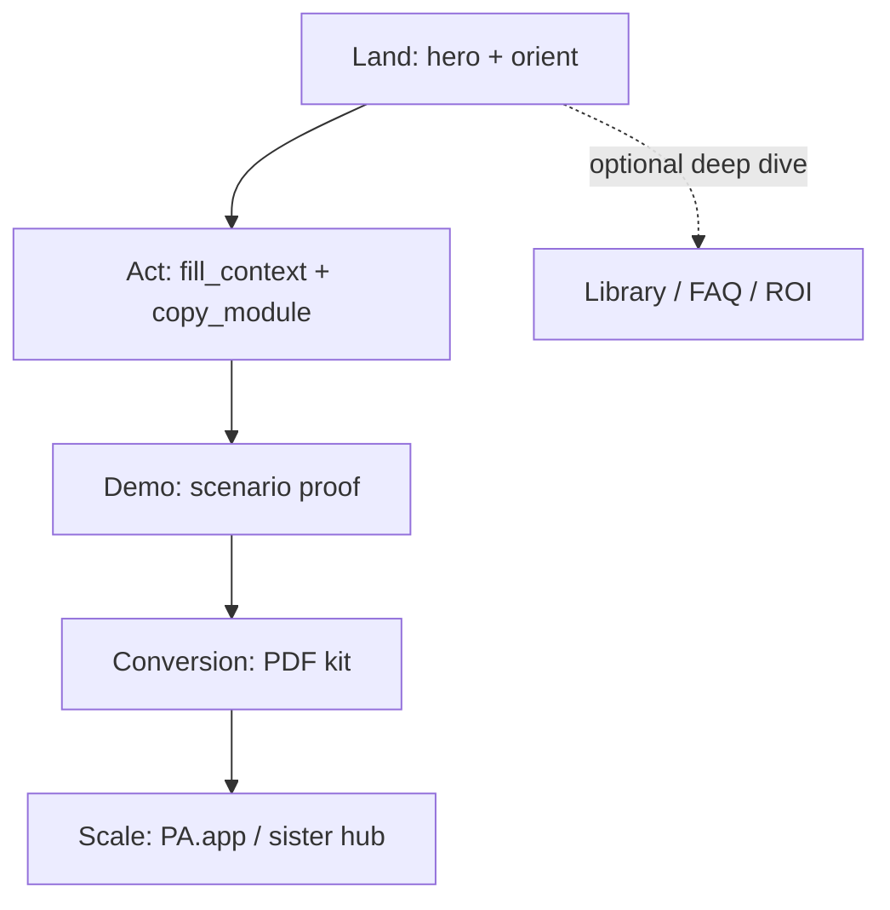
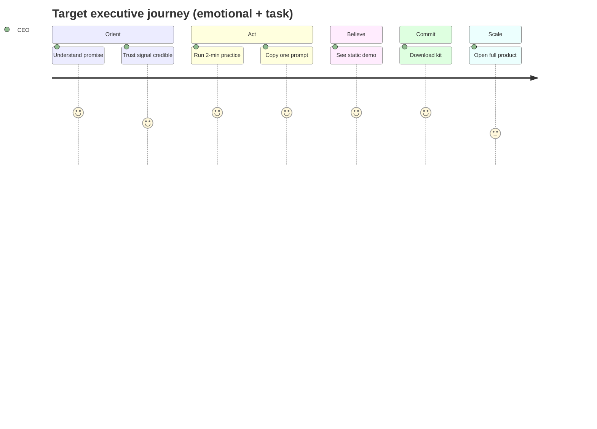
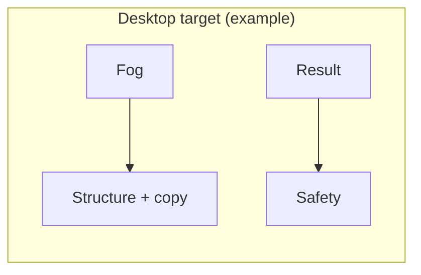

# Strategic revision plan — PromptAnatomy Executive OS (CEO/COO landing)

**Audience:** product owner, design, and engineering.  
**Scope:** content, information architecture, CTAs, visuals, diagrams/schemes, bilingual parity, and static MVP constraints from `AGENTS.md` / `project-direction.mdc`.  
**Non-goals:** backend, login, analytics scripts, or turning the page into a course app.

---

## Executive summary (read this first)

**Goal:** One static page that orients a CEO in seconds, runs a **Global Context + Modules** action (copy one compiled prompt), proves value in the demo, converts with the printable kit (`#kit`), then optionally hands off to PromptAnatomy — with EN/LT parity and no backend.

**Canonical “what shipped” references:** [`CODEBASE_OVERVIEW.md`](CODEBASE_OVERVIEW.md), [`CHANGELOG.md`](../CHANGELOG.md), [`src/layouts/Page.astro`](../src/layouts/Page.astro).

**Themes that drive the backlog in §1–12:** (1) one visually primary CTA per major section where possible; (2) deduplicate safety, PDF, and “free/static” messaging; (3) keep depth (anatomy, 35-prompt library) optional and last.

**Next steps to pull from this doc:** prioritize any open items in §4 (CTA ladder), §5 (content), and §6 (visuals) — treat rows below as the detailed spec, not a daily checklist.

---

## 1. Purpose and alignment

### 1.1 Mission (from `AGENTS.md`)

| Commitment | Implication for revision |
|------------|----------------------------|
| One page, fast aha | **Cap** scroll depth and **one** dominant story arc per viewport “chapter.” |
| Under ~10 seconds to understand | Above-the-fold must answer: *what is this, what do I do, what do I get* without scrolling. |
| Static MVP | All improvements must remain copy, layout, assets, and light client JS. |
| Bilingual EN/LT | Every UI string (including disclosure labels) lives in `copy.ts`. |
| Conversion path | Context+Modules → proof → kit download → optional PromptAnatomy — **order and emphasis** matter more than new features. |

### 1.2 North-star outcome

**After revision, a CEO should be able to:**

1. Understand the offer in **one screen** (hero).
2. **Do** the context+modules action without cognitive overload.
3. **See** static proof (demo) without hunting for it.
4. **Download** the kit with a clear reason *why* now.
5. **Optionally** open PromptAnatomy when they want team scale — not before step 2–4 feel complete.

---

## 2. Situation summary (baseline)

- **Strengths:** Strong copy model (decision, risk, trade-off, owner), consistent gold/navy system, clipboard UX with fallback, real `/en/` `/lt/` routes, PDF + schema + FAQ depth.
- **Friction:** Long vertical stack, **multiple competing primary CTAs**, placeholder trust strip, **meme narrative order** on page vs. `copy.ts` sequence, **FAQ before** final conversion block, **`#demo` missing from nav`**, **`#system` anchor far below** the hero link, safety **repeated** across practice / safety section / ROI step 1, LT gap on library **“Reveal prompt”** string.

This plan turns those frictions into **sequenced work**, not a single big-bang rewrite.

---

## 3. Target user journey (strategic)

### 3.1 Funnel roles

Assign **exactly one primary job** per zone so CTAs stop competing.

| Zone | Primary job | Allowed secondary |
|------|-------------|-------------------|
| **A — Orient** | Understand + trust | Language, skip link |
| **B — Act** | Complete practice + copy | Link to demo anchor |
| **C — Believe** | See proof (demo) + optional anatomy | Copy prompts only |
| **D — Commit** | Download PDF | Single “full product” link |
| **E — Scale** | PromptAnatomy + sister hub | Legal/footer |

### 3.2 Ideal journey (post-revision)

### 3.3 Current vs target section order (conceptual)

**Current (simplified):** Hero → Trust → Practice → Safety → Memes → Anatomy → Meme → ROI → Demo → FAQ → Bridge → Meme → CTA → Meme → System → Library.

**Target (conceptual — phases may implement partially):**

1. **Orient:** Hero (+ optional **real** trust signal or remove placeholder strip).
2. **Act:** Context Block + Modules (compiled prompts) with one safety surface (rules / send-check).
3. **Believe:** Demo **earlier** than long theory blocks *or* theory collapsed behind “How it works” disclosure.
4. **Habit (optional):** ROI path **after** demo + download motivation *or* shortened to inline strip.
5. **Commit:** Single **conversion band** (PDF primary, PA secondary).
6. **Scale:** Authority bridge + footer.
7. **Depth:** System visual + library **last**, both clearly “reference.”

---

## 4. CTA strategy (detailed)

### 4.1 Problems today

- Hero **primary** pushes **off-site** before practice (conversion-first vs. comprehension-first tension).
- **PDF** appears in mobile menu, demo follow-up, library, course CTA — good for reach, **bad for story** (“when should I click?”).
- **Two destinations** on AuthorityBridge split attention (mother vs sister).

### 4.2 CTA rules (revision policy)

1. **One visual primary button** per major viewport section (hero, practice end, demo end, final CTA band).
2. **Hero:** Prefer **primary = scroll to `#practice`** or **primary = `#demo`** with secondary = PromptAnatomy *or* PDF — pick **one** strategy per iteration and measure qualitatively (internal review).
3. **PromptAnatomy:** Reserve **primary** treatment for **after** demo or after first successful copy action (micro-commitment).
4. **PDF:** Keep **one** “canonical” download moment in the main story (e.g. post-demo + repeated in footer or library only).
5. **UTMs:** Keep existing parameters; document a **matrix** in `VISUAL_CONTENT_MAP.md` or a small `docs/UTM_MATRIX.md` so new links stay consistent.

### 4.3 Recommended CTA ladder (default recommendation)

| Step | Primary CTA label intent | Destination |
|------|--------------------------|-------------|
| 1 | “See the 2-minute practice” / equivalent | `#practice` |
| 2 | “Copy template” / “Open demo” | in-page |
| 3 | “Download CEO/COO kit (PDF)” | static PDF |
| 4 | “Open PromptAnatomy” | `promptanatomy.app` with UTM |

Hero gradient button should align with **row 1** unless you explicitly choose a “product-led” variant for a campaign.

### 4.4 Authority bridge

- **Option A (clarity):** Mother card = **primary** (full platform); sister = text link or smaller card.
- **Option B (ecosystem):** Equal weight but **explicit copy**: “Choose one next step” + one sentence each — reduces ambiguity.

---

## 5. Content revision plan

### 5.1 Hero and orient

| Action | Detail |
|--------|--------|
| **Tighten** headline/subhead to **one** outcome + **one** mechanism (already improved in changelog; revisit after CTA change). |
| **Trust:** Replace placeholder row with **real logos**, **client quotes**, or **remove strip** until assets exist — **never** “placeholder” in customer-facing copy. |
| **Nav:** Add `#demo` and optionally `#library`; keep `#practice` and `#system` or rename “Full system” to match actual content (“How the OS fits together”). |

### 5.2 Practice + safety (de-duplication)

| Action | Detail |
|--------|--------|
| **Merge narrative:** Treat SafetyCheck as **expansion** of practice step 4, not a second chapter — e.g. one section with **tabs** or **anchor jump** “Full safety prompt” inside the same `<section>` landmark. |
| **Copy:** One “risk shield” message; SafetyCheck bullets become **appendix** or collapsible. |

### 5.3 Prompt anatomy + ROI

| Action | Detail |
|--------|--------|
| **Anatomy:** Consider `
` “Five blocks (expand)” default **closed** for scan-first CEOs. |
| **ROI:** Shorten body copy; keep **one** diagram; consider **mobile-first** linear story as the **canonical** copy and desktop ring as enhancement. |

### 5.4 FAQ

| Action | Detail |
|--------|--------|
| **Move** FAQ **below** final conversion band **or** reduce to **3** questions in the conversion zone and move the rest down. |
| FAQ answers should **not** repeat entire safety essay — link to section anchors. |

### 5.5 Memes

| Action | Detail |
|--------|--------|
| **Fix order** so on-page sequence matches `memes.items` narrative (indices 3 and 4 swap in `Page.astro` **or** reorder copy array with explicit mapping table). |
| **Update** `docs/VISUAL_CONTENT_MAP.md` to match **actual** `Page.astro` order and remove obsolete `ProofStrip` references. |
| **Optional:** Reduce from five to **three** moments (keep strongest story beats); A/B via stakeholder review, not code flags unless you add env-based toggles later. |

### 5.6 Prompt library

| Action | Detail |
|--------|--------|
| Move **“Reveal prompt”** to `copy.ts` EN/LT. |
| Keep library **last**; consider **default closed** for outer `
` (verify current behavior). |

### 5.7 Bilingual checklist (every iteration)

- [ ] All new strings in `uiCopy.en` **and** `uiCopy.lt`
- [ ] `language-standard.mdc` compliance (forms, DI wording, etc.)
- [ ] Scenario labels and chip UI in demo + library

---

## 6. Visuals and schemes (diagrams)

### 6.1 Visual principles

| Principle | Application |
|-----------|-------------|
| **One focal panel** per section | Avoid 4 equal-weight columns on first paint for practice; use **2×2** or **stepper** on desktop. |
| **Premium over playful** | Memes: either **curated illustration** style aligned with brand **or** fewer memes; avoid stock that reads as “social meme page.” |
| **Real assets over placeholders** | Ship `VISUAL_CONTENT_MAP.md` priority assets (hero screenshot, before/after) when ready **or** remove references from live layout. |

### 6.2 FlowScheme (hero)

| Iteration | Improvement |
|-----------|-------------|
| I1 | Ensure **one** sentence bridge to `#practice` (already have `bridgeNote` — audit line length for LT). |
| I2 | Optional: **animate** nothing; if adding motion, respect `prefers-reduced-motion`. |
| I3 | If hero CTA points to practice, add **subtle** “You are next ↓” affordance (text only, no gimmick). |

### 6.3 QuickPractice layout (scheme)

**Problem:** Four parallel columns = boardroom-unfriendly scan.

**Directions:**

- **Desktop:** `2×2` grid (rows: Fog+Structure / Result+Safety) **or** horizontal **stepper** with 4 numbered steps and one active panel.
- **Mobile:** Already vertical — ensure **sticky** “Copy template” on large phones optional (phase 3 polish).

### 6.4 RoiPath (weekly cycle)

| Iteration | Improvement |
|-----------|-------------|
| I1 | Add **printable one-liner** under diagram: “Six moves = ~5h/week” linking to PDF page anchor. |
| I2 | Ensure desktop **panel copy** button remains wired after any script bundling change — prefer `data-copy-i18n` in SSR HTML for that button. |
| I3 | **Reduce** node copy to headline + 8 words max per node; details only in panel. |

### 6.5 ClarityDemo

| Iteration | Improvement |
|-----------|-------------|
| I1 | **First scenario** = highest recognition (meeting) — already default; document in QA. |
| I2 | Visual **connector** (arrow or “transforms”) between messy input and structured output. |
| I3 | After scenario change, **focus management** announcement for screen readers (`aria-live` polite on output region). |

### 6.6 SystemVisual

| Iteration | Improvement |
|-----------|-------------|
| I1 | Reconcile with `workflow-map.svg`: either **embed** map again in card header **or** delete orphan asset references from docs. |
| I2 | Rename nav target if content is “operating layers” not “full product UI.” |

---

## 7. Information architecture checklist

- [ ] Single **ordered** `<main>` landmark story (hero trust inside or outside `<main>` — pick semantics and stick to it).
- [ ] **Meme** `index` vs `copy.memes.items` **mapping table** in code comment + `VISUAL_CONTENT_MAP.md`.
- [ ] Skip link targets the **first interactive** practice region, not only `#practice` container top — verify focus visibility.
- [ ] Footer remains minimal; mother links + legal.

---

## 8. Phased implementation (iterations)

Work is split so **each phase** leaves the site shippable (`npm run build`, Lighthouse CI if enabled).

### Phase 0 — Quick wins (1–3 days)

**Goal:** Remove obvious trust and i18n defects; align docs.

| # | Task | Files / area |
|---|------|----------------|
| 0.1 | Fix **meme order** to match narrative `items[0]…[4]` OR document intentional shuffle in map + comments | `Page.astro`, `VISUAL_CONTENT_MAP.md` |
| 0.2 | **“Reveal prompt”** → `copy.ts` + `PromptLibrary.astro` | `copy.ts`, `PromptLibrary.astro` |
| 0.3 | **Hero nav:** add `#demo`; consider `#kit` anchor on final PDF band | `Hero.astro`, `copy.ts` `nav` |
| 0.4 | **HeroTrust:** remove or replace placeholder — minimum: **hide** strip via flag until logos exist | `HeroTrust.astro`, `copy.ts` |
| 0.5 | **CHANGELOG** + this plan: note any scope decision | `CHANGELOG.md` |

**Exit criteria:** No English-only UI in LT library; no contradictory meme map in docs; nav covers demo.

---

### Phase 1 — CTA and journey spine (3–7 days)

**Goal:** One clear spine: Practice → Demo → PDF → PA.

| # | Task | Files / area |
|---|------|----------------|
| 1.1 | **Hero primary CTA** → `#practice` (or `#demo`); **secondary** → PromptAnatomy or PDF per §4.3 | `Hero.astro`, `copy.ts` hero |
| 1.2 | **Reorder sections** toward target §3.3 (minimum: move **ClarityDemo** above **RoiPath** + **Anatomy** *or* collapse anatomy) | `Page.astro` |
| 1.3 | **FAQ** moved below **CourseCTA** (or split FAQ) | `Page.astro` |
| 1.4 | **PDF canonical:** demote duplicate CTAs in demo/library to **text link** “PDF again” where needed | components + copy |
| 1.5 | **AuthorityBridge:** implement §4.4 Option A or B with copy change | `AuthorityBridge.astro`, `copy.ts` |

**Exit criteria:** Stakeholder walkthrough: “I know what to click first”; CTAs don’t fight in hero + endcap.

---

### Phase 2 — Density and de-duplication (1–2 weeks)

**Goal:** Fewer repeated lessons; faster scan.

| # | Task | Files / area |
|---|------|----------------|
| 2.1 | **Practice layout** redesign (2×2 or stepper) | `QuickPractice.astro`, `global.css` |
| 2.2 | **Safety + practice** merge or shared section with one `<h2>` | `SafetyCheck.astro`, `QuickPractice.astro`, `Page.astro` |
| 2.3 | **PromptAnatomy** default collapsed (details) | `PromptAnatomy.astro` |
| 2.4 | **RoiPath** copy trim + optional SSR `data-copy-i18n` on panel button | `RoiPath.astro`, `copy.ts` |
| 2.5 | **Meme count** reduction (optional) + asset audit | `Page.astro`, `public/assets/memes/` |

**Exit criteria:** Practice + safety readable in **under 2 minutes** on a laptop without horizontal scan of four equal columns.

---

### Phase 3 — Visual premium and assets (ongoing)

**Goal:** Perceived quality matches PromptAnatomy mother brand.

| # | Task | Files / area |
|---|------|----------------|
| 3.1 | Ship **hero screenshot** or **before/after** per `VISUAL_CONTENT_MAP.md` | `public/assets/…`, `Hero` / new section |
| 3.2 | Replace meme art with **on-brand** illustrations *or* keep 3 strongest | design + `MemeMoment.astro` |
| 3.3 | **SystemVisual** + workflow map reconciliation | `SystemVisual.astro`, docs |
| 3.4 | Micro-interactions: demo input/output connector; focus rings audit | components, `global.css` |

**Exit criteria:** No placeholder trust; visuals support one story arc.

---

## 9. Risk register

| Risk | Mitigation |
|------|------------|
| Moving demo up **reduces** SEO keyword block size at top | Keep strong `<h1>` / meta; anatomy can stay indexable in collapsed HTML. |
| Fewer memes **reduces** “rest” pacing | Shorter paragraphs + whitespace instead. |
| CTA change **drops** early PA clicks | Accept for mission alignment **or** run time-boxed “product-led hero” variant only on campaign branches (out of scope unless you add branch builds). |

---

## 10. Verification (each phase)

- `npm run build` with production `BASE_PATH` / `SITE_URL` if applicable.
- Manual: EN + LT pass, keyboard-only, mobile 375px.
- Lighthouse / axe thresholds per `QUALITY_ASSURANCE.md` if CI active.
- Update **`CHANGELOG.md`** for user-visible or structural changes per `AGENTS.md`.

---

## 11. Document maintenance

| Document | When to update |
|----------|----------------|
| `docs/VISUAL_CONTENT_MAP.md` | Any meme order, hero asset, or section order change |
| `docs/CODEBASE_OVERVIEW.md` | New components or removal of sections |
| `docs/STRATEGIC_REVISION_PLAN.md` (this file) | After each phase: mark completed items, date, and decisions |

---

## 12. Decision log (fill as you go)

Use this table when choices are made so future agents do not revert blindly.

| Date | Decision | Rationale |
|------|----------|-----------|
| 2026-04-28 | Hero primary CTA = `#context` (scroll); secondary = PromptAnatomy | Comprehension-first ladder per §4.3 |
| 2026-04-28 | Trust strip = hidden (`showPlaceholderLogos: false`) until real logos | No customer-facing “placeholder” labels |
| 2026-04-28 | Meme count = 5; order fixed to `items[0]…[4]` on page | Matches narrative in `copy.ts` |
| 2026-04-28 | FAQ position = after `CourseCTA` (`#kit`) | Commit band before depth |
| 2026-04-28 | Authority bridge = Option A (mother card, sister text link) | Single visual primary per §4.4 |
| 2026-04-28 | Spine reorder = `#context` → `#demo` → `#safety-check` → `#kit` | Act → proof → safety gate → commit before depth |
| 2026-04-28 | RoiPath safety step uses `#safety-check` link instead of duplicating the full safety prompt | Reduce repetition fatigue; one canonical safety prompt surface |

---

*End of strategic revision plan.*
