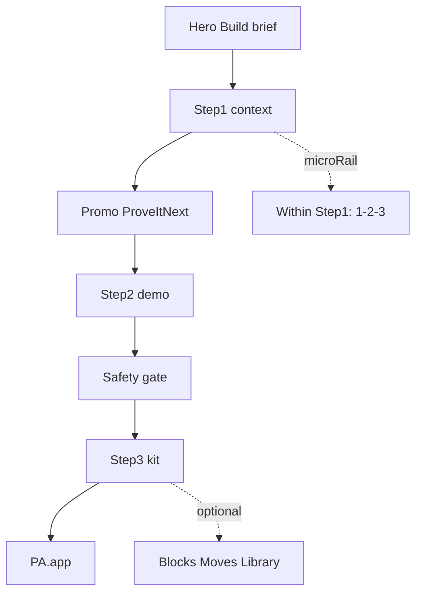

# User journey — macro Step 1–3 (Option A)

Canonical conversion spine for PromptAnatomy Executive OS. Section order = [`src/layouts/Page.astro`](../src/layouts/Page.astro). Copy authority = [`src/content/locales/en.ts`](../src/content/locales/en.ts).

## Macro ladder (page-level)

| Step | Anchor | Section eyebrow | Hero nav (friendly) | Primary job |
|------|--------|-----------------|---------------------|-------------|
| — | (hero) | Executive decision kit | — | Orient |
| **1** | `#context` | Step 1 · Define your business context | How it works | Fill context, pick module, copy brief |
| bridge | — | Prove it next (PromoBanner) | — | Hand off to proof |
| **2** | `#demo` | Step 2 · Prove on a scenario | Example | Clarity practice on sample scenario |
| gate | `#safety-check` | Safety check (not numbered) | — | Risk review before send |
| **3** | `#kit` | Step 3 · Download the kit | What you get | PDF download |
| scale | (outbound) | — | — | PromptAnatomy.app when team standard needed |

**Label authority:** Section **eyebrows** carry Step 1–3. Hero **nav** stays unnumbered (executive-friendly shorthand). Do not add Step 4 on-page for PromptAnatomy — scale is post-kit.

## Micro-rail (within Step 1 only)

`WorkflowStepRail` in `#context` shows **1 → 2 → 3** as an in-step recipe:

1. Define context (four fields)
2. Choose a module
3. Copy your brief

`workflowAriaLabel` must prefix **“Within Step 1”** so users do not confuse micro-steps with page Steps 2–3.

## Depth vocabulary (not macro steps)

| Zone | Label | Purpose |
|------|-------|---------|
| `#anatomy` | Block 1–5 | Framework reference (Role, Context, Decision Logic, Output, Quality Check) |
| `#roi` | Move 1 of 5 | Weekly operating rhythm |
| `#library` | Categories | 35-prompt appendix |

Never use “Step 1” in Anatomy or ROI — that collides with macro Step 1 at `#context`.

## Spine flow

## Persona paths

### Golden (recommended)

Hero → `#context` (fill + copy module) → Promo → `#demo` (scenario + copy) → optional safety → `#kit` (PDF).

Success: user can name Steps 1–2–3 without using nav.

### Skeptic

Nav **Example** → `#demo` → `#kit`. Step 2 and Step 3 eyebrows must still read as a continuous ladder.

### Operator

Stay in `#context`, copy multiple modules, skip demo, download kit. Step 2 is proof, not a hard gate.

### Deep diver

Full scroll → `#anatomy` (blocks) → `#roi` (moves) → `#library`. Depth must not reset to “Step 1.”

## Anti-patterns (do not reintroduce)

1. **Only Step 1 labeled** on page with no Step 2/3 eyebrows.
2. **Four step systems** — macro Step, context rail, Anatomy Step, ROI Step.
3. **Second gold CTA** at end of `#context` competing with PromoBanner → `#demo`.
4. **PromptAnatomy primary** before demo or kit (proof-before-scale).
5. **Renumbering nav** to Step 1/2/3 — keep How it works / Example / What you get.

## CTA ladder

| Beat | Primary CTA intent | Destination |
|------|-------------------|-------------|
| Hero | Build my decision brief | `#context` |
| Promo | Start the scenario | `#demo` |
| Demo end | Download PDF kit | `#kit` |
| Kit | Download Max Value Kit | PDF |
| Scale | Open PromptAnatomy | `promptanatomy.app` (UTM) |

See [`STRATEGIC_REVISION_PLAN.md`](STRATEGIC_REVISION_PLAN.md) §4.3 and [`UTM_MATRIX.md`](UTM_MATRIX.md).

## QA (5 min)

1. Scroll: Step 1 eyebrow → Prove it next bridge → Step 2 eyebrow → Download the kit next bridge → Step 3 eyebrow (only three visible “Step N” labels on section eyebrows).
2. Workflow rail aria: “Within Step 1.”
3. Anatomy: Block N only. ROI: Move N of 5 only.
4. Promo `aria-label` matches e2e smoke test.
5. Skeptic path: nav Example → demo → kit feels coherent.

## Related docs

- [`CODEBASE_OVERVIEW.md`](CODEBASE_OVERVIEW.md) — section order and anchors
- [`COPY_AUDIT_BY_SLIDE.md`](COPY_AUDIT_BY_SLIDE.md) — per-slide copy keys
- [`DEFINITION_OF_DONE.md`](DEFINITION_OF_DONE.md) — ship gate
